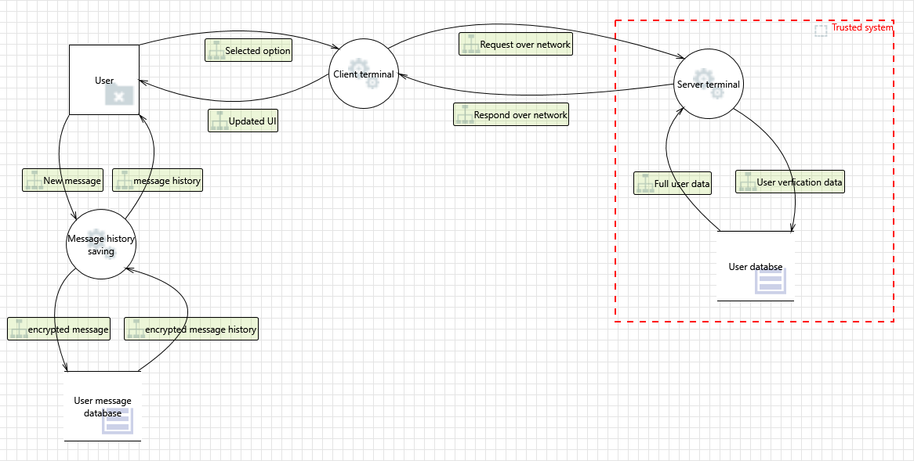

# Secure Messaging Application

This is the Gitlab repository for the Secure Messaging project for **group 16**

| Requirement	| Result 		| 
| -------------	|-------------:| 
|SM must support 1:1 messaging and may support group chats (that’s optional)| Only support 1:1 message|
|Text messages as well as pictures should be supported|Integrated GUI for text & image display|
|Message history is kept in encrypted form (at-rest encryption)| Message history is encrypted and stored locally|
|Message history (for a particular conversation) can be deleted by a user| User can delete message at their end|
|Message transport uses end-to-end encryption with perfect forward secrecy|Message in trsport is encrypted with DH key and message history is not tranported through network|
|Users are authenticated | Server confirm sender/reciver authentication|
|Message integrity must be assured| To be implemented|
|Users can plausibly deny having sent a messag|To be implemented|
|Users can sign up for an account and also delete their account|User can request change to the user database|
|SM must be implemented in Python| All the functional code is implemented in Python|

